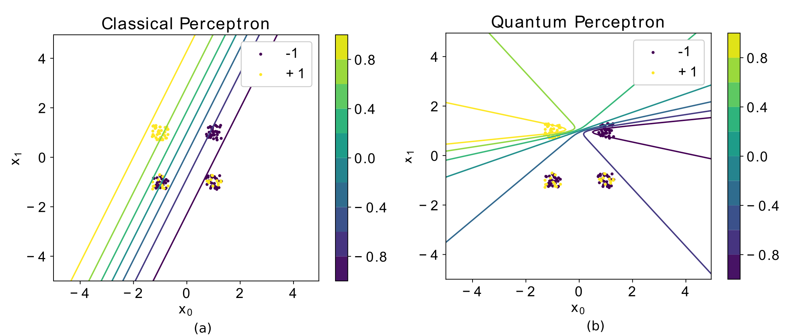

## Introduction 
The goal of this research project was to show that we can construct quantum statistics from classical data, and subsequently use this
information to improve on the classical perceptron model. In a 2019 [Physical Review A](https://journals.aps.org/pra/abstract/10.1103/PhysRevA.100.020301) paper [1], 
we show that this can lead to noticeable performance gain for certain data sets. This research was done at Raboud University under
supervision of professor Bert Kappen and was the main subject of my master's thesis, which can be found [here](https://github.com/therooler/master-thesis/blob/master/main.pdf) [2].

## Classical Perceptron
The classical perceptron is a linear classifier that can be used for binary classification. It assigns a probability
$$p(y = 1|x) = f(x\cdot w)$$ to a class $$y \in \{0,1\}$$, based on input $$x$$ and trainable weights $$w$$ with $$f(x)$$ a nonlinear 
activation function. The activation function of the perceptron is often taken to be a sigmoid, since it produces an 
output between $$0$$ and $$1 $$ and is equivalent to logistic regression. In short,

$$p(y=1|x;w) = S (x\cdot w)$$

Where $$S:\mathbb{R} \to \mathbb{R} $$ is the sigmoid activation function. The perceptron is of particular 
interest in machine learning because it is the building block of multilayer neural networks, 
the driving force behind deep learning.

Learning the correct weights to provide the optimal classification of the data requires a cost associated with how well our
model is predicting the data. For the classical perceptron, we use the negative log-likelihood for this. 

$$\mathcal{L} = - \sum_x q(x) \sum_y q(y|x) \log p(y|x;w)  \quad(1)$$

Here, $$q(x)$$ is the empirical probability of observingx, $$q(y|x)$$ is the empirical conditional probability 
of observing label $$y$$ for data $$x$$, and $$p(y|x,w)$$ is the proposed model conditional probability distribution of the data.
By minimizing this cost function with respect to the parameters $$w$$, we find the optimal model to explain the data (This cost function is convex). 

## Quantum Perceptron
To extend the classical likelihood in Eq. (1) to the realm of quantum mechanics we require a description ofour model and 
the conditional probability $$q(y|x)$$ in termsof density matrices. The density matrix contains the classical uncertainty 
we have about a quantum state. If this matrix is rank one, we have what is known as a pure state, in which case there is no classical 
uncertainty about what quantum state the system is in. If the density matrix has rank$$>1$$, then we have a so-called mixed state. 
For our model we will consider a parametrized mixed state, since this will allow us to capture the uncertainty in the data. 
To perform learning, we require a learning rule that preserves the Hermiticity, positive semidefiniteness and trace of the density matrix.
We consider the specific case where the data consist of $$N$$ discrete vectors $$x\in \{1,−1\}^d$$ with $$d$$ bits and $$y\in\{1,−1\}$$ labels. 
We define the quantum log-likelihood as a cross entropy between a conditional data density matrix $$\eta_x$$ and a model conditional density 
matrix $$\rho_x$$, analogous to Eq. (1).  For each $$x$$, we construct a wave function based on the empirical conditional probabilities $$q(y|x)$$

$$|\psi\rangle = \sqrt{q(1|x)}|1\rangle + \sqrt{q(1|x)} |-1\rangle$$

Then, we define $$\eta_x = \vert\psi \rangle \langle \psi\vert$$. Our model density matrix  is defined as 

$$\begin{align} \rho_x &= 1+ \sum_i \sigma^k m^k(x;w^k)\\
m^k &= \tanh(h) \frac{h^k}{h}\\
h^k &= x\cdot w^k \quad \text{and} \quad \sqrt{\sum_k h^k} \end{align}$$

Where, $$\sigma^k$$ is one of the three pauli matrices. For the full derivation and motivation of this model, 
see the [full paper](https://arxiv.org/abs/1905.06728) [1]. With these definitions in place, we can write the the quantum negative log-likelihood
as 

$$\mathcal{L}_q = - \sum_x q(x) \eta_x \log \rho_x $$

Minimizing this cost function with respect to the parameters $$w^k$$ gives us update rules with specific properties

$$ \begin{align}\frac{\partial \mathcal{L}_{q}}{\partial \mathbf{w}^x} &= -\sum_{\mathbf{x}} q(\mathbf{x})  \left(\sqrt{1 - b(\mathbf{x})^2}  - \frac{h^x}{h} \tanh h \right)\mathbf{x}\\
\frac{\partial \mathcal{L}_{q}}{\partial \mathbf{w}^y} &= \sum_{\mathbf{x}} q(\mathbf{x})  \left(\frac{h^y}{h} \tanh h\right)  \mathbf{x}\\
\frac{\partial \mathcal{L}_{q}}{\partial \mathbf{w}^z} &= -\sum_{\mathbf{x}} q(\mathbf{x})  \left( b(\mathbf{x}) - \frac{h^z}{h} \tanh h \right)\mathbf{x} \end{align}$$

Where $$b = \frac{1}{M}\left(\sum_{x^\prime} y^{\prime}\mathbb{I}(x^\prime=x)\right)$$ and $$ M = \sum_{x^\prime}\mathbb{I}(x^\prime = x)$$.
What do these gradients tell us? First of all,
the $$w^y$$ weights have a fixed point solution that is always zero, so they serve no purpose in our model.
Secondly, if the $$w^x$$ weights are zero, then the quantum model and likelihood reduce to their classical equivalents. 
The proposed quantum perceptron is thus a generalization of the classical perceptron. Finally, we see that the solutions 
of the classical and quantum model diverge for non-zero $$w^x$$. More specifically, in the case of non-zero $$w^x$$ the curves of
probability are given by quadric surfaces instead of a hyperplane (see the appendix of the full paper for a more detailed explanation). 
This divergence occurs when $$1 - b^2 \neq 0$$, or in other words, when there are no unique $$x$$ in the data with conflicting labels $$y$$.
An example of the behaviour of this model can be seen in the figure below.

***Figure 1.)*** *Consider the data $$x = \{(1,1),$(1,-1), (-1,1), (-1,-1) \}$$  with labels $$y = \{-1,-1,1,-1\}$$ respectively. 
This problem is trivial since it is linearly separable and both the classical and quantum perceptron converge to the same solution ($$w^{x,y}=0$$ 
and $$w^z \approx w_{cl}$$). However, if we flip some of the output labels to simulate mislabeled samples or errors in 
the data, we suspect that the quantum perceptron will perform better. We make $$40$$ copies of the four data points in the binary feature
 space and for $$x\in \{(1,-1),(-1,-1)\}$$ we flip $$30\%$$ of the outputs from $$-1$$ to $$1$$. 
 The probability boundaries of the perceptrons differ significantly. The quantum peceptron is better in capturing the uncertainty in the data
 by assigning quadric probability boundaries.*

## Conclusion

We found that introducing a quantum model can lead to non-trivial behaviour in the model that can lead to an improved performance for specific problems.

### Bibiliography

[1] *Implementing perceptron models with qubits*, R. C. Wiersema and H. J. Kappen, **Phys. Rev. A 100, 020301(R)**, 2019

[2] *Quantum Perceptron Learning*, R. C. Wiersema, **Master's thesis**, 2019